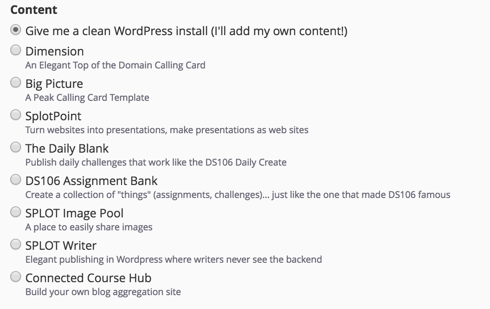

# Instant SPLOTs

Wordpress SPLOTs and other sites all in one file. Just import, stir, and go.

*"Nissin Bowl Soup Instant Noodles, Kimchi Flavour" flickr photo by elsie.hui https://flickr.com/photos/elsiehui/9129779517 shared under a Creative Commons (BY) license*

This site contains a collection of files that can be used via a plug-in to export the set-up for a number of my Wordpress-based projects/tools. This may be the easiest way I can think if to make it simple to get started with [SPLOTs](http://splot.ca) and more.

To use these, you need access to your own web hosting account where you can install Wordpress (hint, if you do not have one, go now and get one [Reclaim Hosting](http://reclaimhosting.com/). 

## No Hosting? Go to State U 

However there is another option to go for a test drive- use Reclaim's demo site http://stateu.org/ where you can use a complete hosting package free for 30 days. If you make something you like, they can migrate your stuff to an account. On the StateU site, when you install Wordpress, you will get options to do so with pre-configured, complete sites:

You will get a complete version of thee tools with all themes, plugins, and even some goofy content. Just install, go, and experiment. 

If you want some more guidance in using these pre-built installs see the [Staking a Claim on the Open Web workshop materials](https://connectedcourses.stateu.org/).

## Got Hosting? Use a Packaged Kit

This is a new experiment, but so far it works. I can offer you a complete site too; all you need to do is boil water... no just kidding. For all the noodles below, what you need to do on your self hosted site is:

* **Install Wordpress** into a domain, subdomain, directory of existing domain, typically from your cpanel You do not need to do anything to it. Just make sure you can log in as admin.
* **Download the appropriate package file below.** Expand the zip for a file ending in `.wpress`
* **Install a Plugin** In your new site's Dashboard, go yo Plugins, and search for, instal, and activate the [All-in-One WP Migration](https://wordpress.org/plugins/all-in-one-wp-migration/) plugin.
* **Import the Package** Once the plugin is installed, look for it listed in the left side of your Wordpress dashboard- select the option below it for **Import** Drag and drop the file `.wpress` to the importer. Wait for it to simmer/upload. You will be asked to confirm over writing an existing site. Agree.

Once imported, you can de-activate and delete the All-in-One WP Migration plugin.

It's done. You will have to log in toy your site as admin again to start enjoying your noodles.

---

### Instant Site Package for the TRU Writer

This download needs everything you need to set up a [TRU Writer site](http://splot.ca/splots/tru-writer/). 

* [Download TRU Writer wpress Package](https://github.com/cogdog/instant-splot/raw/master/noodles/tru-writer-wpress.zip)
* [TRU Writer Documentation](https://github.com/cogdog/truwriter)

I suggest generating a new password for the `writer` user account, copying it, and then pasting it in the TRU Writer options for this value. [See documentation](https://github.com/cogdog/truwriter#author-account-setup) for more details

